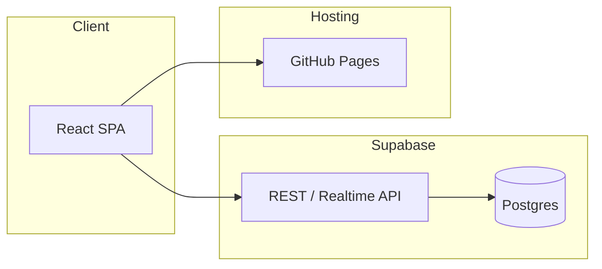

# Recipe App: Tech Stack and Implementation Plan

## Recommended tech stack

| Layer              | Choice                         | Why                                                                                                   |
| ------------------ | ------------------------------ | ----------------------------------------------------------------------------------------------------- |
| **Frontend**       | React 18 + Vite + Tailwind CSS | Fast dev experience, mobile-first with Tailwind, small bundle.                                        |
| **Database & API** | Supabase (Postgres)            | Free tier (500 MB, unlimited API requests), auto REST/API, no backend code; add auth later if needed. |
| **Hosting**        | GitHub Pages                   | Free static hosting; deploy from repo (e.g. `gh-pages` branch or GitHub Actions).                     |

No separate backend server: the app talks to Supabase from the browser via `@supabase/supabase-js`. Supabase provides the database and HTTP API.

**GitHub and database:** GitHub does not offer a database. It provides code hosting, Actions, and GitHub Pages (static sites only). The database must be a separate service; this plan uses Supabase (free tier). Hosting = GitHub Pages; data = Supabase.

---

## Data model

**Recipe** — single table `recipes`:

- `id` (uuid, primary key, default `gen_random_uuid()`)
- `title` (text, required)
- `description` (text, nullable)
- `ingredients` (jsonb) — array of objects, each with:
  - `name` (string, required)
  - `quantity` (number, required)
  - `unit` (`'piece'` or `'grams'`, required)
- `calories` (integer, nullable)
- `created_at` (timestamptz, default `now()`)

Example ingredient in JSON: `{ "name": "flour", "quantity": 200, "unit": "grams" }`. TypeScript: `{ name: string; quantity: number; unit: 'piece' | 'grams' }`.

Supabase will expose this as a REST API and real-time subscriptions out of the box.

---

## High-level architecture



- **Client**: Single React app (Vite), mobile-first CSS (Tailwind), client-side routing (e.g. React Router).
- **Supabase**: Postgres + Row Level Security (RLS) can be left permissive for now since there’s no auth; lock down later when you add users.
- **GitHub Pages**: Serves the built static assets from the repo; GitHub does not provide a database.

---

## Implementation steps

1. **Scaffold frontend**

- Create Vite + React + TypeScript project.
- Add Tailwind CSS and configure for mobile-first (e.g. base styles and breakpoints).
- Add React Router (e.g. routes: list, add, edit, delete).

1. **Supabase project**

- Create a Supabase project at supabase.com (free tier).
- Create `recipes` table with columns above (SQL in Supabase SQL editor).
- Enable Postgres “table API” so the table is exposed via API.
- Optional: set RLS policies to allow all for now (e.g. `true` for select/insert/update/delete).

1. **Connect frontend to Supabase**

- Install `@supabase/supabase-js`, create a Supabase client (project URL + anon key).
- Store URL and anon key in env (e.g. `VITE_SUPABASE_URL`, `VITE_SUPABASE_ANON_KEY`); use them only in client-side code.

1. **Screens and CRUD**

- **List**: Fetch recipes (e.g. `supabase.from('recipes').select('*').order('created_at', { ascending: false })`), show cards/list; mobile-first layout.
- **Add**: Form (title, description, ingredients as repeatable rows: name + quantity + unit select "piece"/"grams", calories); on submit `supabase.from('recipes').insert({ ... })`.
- **Edit**: Same form pre-filled from route param id; on submit `supabase.from('recipes').update({ ... }).eq('id', id)`.
- **Delete**: Button/handler that `supabase.from('recipes').delete().eq('id', id)`; confirm before delete.

1. **Mobile-first UX**

- Viewport meta tag, touch-friendly tap targets (min 44px), readable font sizes.
- Tailwind: start with narrow viewport (default), then `sm:`/`md:` for larger screens if needed.
- Single-column layout on small screens; list/detail or grid only when space allows.

1. **Deploy (GitHub Pages)**

- **Base path**: If the repo is not `username.github.io`, set Vite `base` to `'/repo-name/'` in `vite.config.ts` so assets and routing work at `https://<username>.github.io/<repo-name>/`.
- **Env vars**: `VITE_SUPABASE_URL` and `VITE_SUPABASE_ANON_KEY` are baked in at build time. For GitHub Actions: add them as repo Secrets and pass into the build; for manual deploy, use `.env` locally, then push built `dist` (or use a workflow that builds with secrets).
- **Publish**: Push `dist` to `gh-pages` branch (or use GitHub Action e.g. `peaceiris/actions-gh-pages`). Add `404.html` → `index.html` redirect so client-side routing works on refresh/deep links.

1. **Optional later**

- Add Supabase Auth and RLS so recipes are per-user.
- Add simple validation (e.g. title required, calories number) on client and optionally in DB constraints.

---

## Alternatives considered

- **Firebase (Firestore)**: Good for no-backend and free tier; you’d store ingredients as array in documents. Chose Supabase for SQL and easier migration to per-user auth/RLS later.
- **Next.js**: Use if you prefer file-based routing and optional API routes. For a simple CRUD app, Vite + React keeps the stack smaller.
- **Neon + Vercel serverless**: Possible but adds API route code and connection handling; Supabase gives you the API and DB in one place for free.

---

## File structure (suggestion)

```
diet-app/
  src/
    components/     # RecipeCard, RecipeForm, etc.
    pages/          # List, AddRecipe, EditRecipe (or use routes in App)
    lib/
      supabase.ts   # Supabase client
    types/
      recipe.ts     # Recipe, Ingredient { name, quantity, unit: 'piece'|'grams' }
  public/
  index.html
  package.json
  tailwind.config.js
  vite.config.ts
  env.example      # VITE_SUPABASE_URL, VITE_SUPABASE_ANON_KEY
```

---

## Summary

- **Stack**: React (Vite) + Tailwind + Supabase + GitHub Pages; no auth, no custom backend.
- **DB**: Single `recipes` table in Supabase; ingredients as jsonb array of `{ name, quantity, unit: 'piece' | 'grams' }`. GitHub does not provide a database; Supabase is used.
- **Hosting**: Frontend on GitHub Pages (free); DB and API on Supabase (free tier).
- **Order of work**: Scaffold app → create Supabase project and table (ingredients jsonb) → wire CRUD with ingredient name/quantity/unit UI → deploy to GitHub Pages (base path + env at build).
